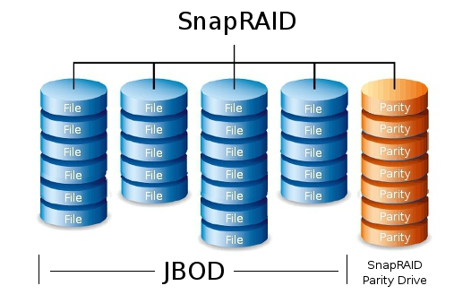
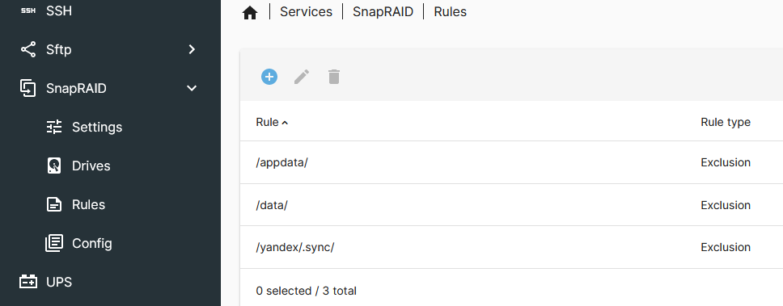

=== пулл дисков

Раздел имеет в основном теоретические заметки, чем практические.

Бывает так, что любимые сериалы хочется сидировать очень долго, но места под них нет.
Или просто лень чистить sonarr библиотеку от отсмотренного.

Вариант от сохи: просто хранить Movies на одном диске, а TV Shows на другом. Но Plex должен где-нибудь на 1м диске хранить библиотеку обложек, трейлеров, музыки и вообще свою sqlite.
Именно по этой причине разбивка по дискам планировалась такая
- hdd media: {disk_media}
- hdd bkp: {disk_bkp}

Это просто, понятно, но придется попотеть над конфигами в докер стеке:
- один конфиг для radarr
- другой конфиг для sonarr
- объединенный конфиг для qbit и plex.
- третий конфиг для subsonic, yandex и daap
- четвертый 

Не то что бы удобно, но имеет право на жизнь

Второй вариант - использовать софт по объединению дисков в пулл.

==== референсы
https://thenomadcode.tech/mergerfs-snapraid-is-the-new-raid-5

==== megrerfs
Для простого обывателя он делает ровно то что нужно - объединяет файловые системы (читай папки) в 1. Но есть сложности с радарром: https://github.com/trapexit/mergerfs#tips--notes, плексом https://github.com/trapexit/mergerfs#plex-doesnt-work-with-mergerfs 

Частое решение использовать mmap https://github.com/trapexit/mergerfs#you-need-mmap-used-by-rtorrent-and-many-sqlite3-base-software

И кастомные политики поисковых действий.

В итоге предполагается использовать разные политики https://github.com/trapexit/mergerfs/tree/2.34.1#policy-descriptions
- для записи торрентов,  Most Free Space политику 
- для поиска обновлений в каталога

===== Ограничения

====== Spindown
На тему экономии электричества или победы над шумом: сам автор говорит что бесполезно пытаться тормозить диски https://github.com/trapexit/mergerfs/wiki/Limit-Drive-Spinup#is-there-anything-that-can-be-done-where-mergerfs-is-involved
и пытаться накраежопить если в теме замешаны plex и торренты. spindown прокатит для действительно редко используемых данных: фото и видео архив. Кино и сериалы пролетают

====== snapraid default pool
Но сама по себе функция сбора виртуального пулла из файловых систем доступна и https://www.snapraid.it/faq#enc 
и встает вопрос о целесообразности дублировать прикладную функцию.
Но если изучить https://www.snapraid.it/manual#4.2 то становится понятна проблема:
пуллинг снапрейда использует симликни и вот так просто пошарить каталог по самбе или через syncthing - не выйдет, это будет только readonly представление, без опции записи.

==== snapraid
https://github.com/amadvance/snapraid
https://www.snapraid.it/manual
https://wiki.omv-extras.org/doku.php?id=omv6:omv6_plugins:snapraid
https://perfectmediaserver.com/02-tech-stack/snapraid/

Многие думают что это аналог софтового рейда. Но это не так.
Это аналог бэкап системы.

Более того, сильнее всего вводит в заблуждение эта схема


Или вот эта
image::diagram-mergerfs-snapraid.png[]

И комментарий, что "диск четности нужен размера больше и равный самому большому диску данных".
Это только отчасти так.

IMPORTANT: Если диск четности один, то его размер должен быть равен сумме всех дисков данных.

Как так? Да очень просто: каждый раз, когда запускается Sync, то содержимое с дата-дисков записывается в диск четности. Прям блобом в файл snapraid.parity. Если данные текстовые, вы даже сможете их прочитать.
Ну а контент файл нужен, что бы хранить источник до оригинального файла, его мету и расположение в парити файле.

Как быть, если в распоряжении все диски маленькие и нет выдающихся по величине?
Первое время можно жить и так, с одим маленьким диском четности, а потом придется выбирать: сделать миграцию на диск четности побольше или приделать несколько дисков четности.
На форуме приложения это обсуждалось здесь https://sourceforge.net/p/snapraid/discussion/1677233/thread/dbfe9572b5/

Если исходить из принципа экономии, то вообще домашний медиа-сервер делают на максимально бюджетных и максимально безотказных дисках. Например: 2-3 ТБ дисках на CMR или 4-5 SMR. Первые банально надежнее, чем SMR и эти объемы - граничные для SOHO сегмента за вменяемые деньги. Но SMR вполне себе имеют место быть при редких записях и частых чтениях и как раз этому паттерну соответствует snapraid. Но если отрыгнет большой диск данных, потребуется большее время его восстанавливать, чем мелкий. К тому же вряд ли домашняя коллекция фото и документов может перевалить за 3 тера. Если не упарываться с RAW.

Выходит, что перед нами простейший raid1, где группа дата дисков зеркалируется с диском четности.
Но здесь есть возможность увеличить суммарный объем группы дисков четности.
Из-за стратегии последовательной записи в парити файл, изменения (не удаления) будут дописывать в новый диск.
Значит, SMR диски - вполне могут показать достойный срок службы.

На изначальный вопрос, "как распределить группу мелких дисков между Data и Parity" теперь можно дать лукавый ответ

TIP: так же как и при raid1, объем зеркала слева и объем зекрала с права дожны быть равны. В SnapRAID объем JBOD Data дисков должен быть равен JBOD Parity дисков. Иначе лишнее пространство не будет использоваться.

"Лукавый" потому что можно можно довставить произвольный диск нуждающейся группе и пространство можно будет утилизировать. Сложно сказать, где предел у этой костылизации. В свободном доступе нет информации об сложностях восстановления N-Parity и об производительности подобного решения.

===== личный сетап

[%autowidth%header,separator=|]
|===
| серийник | устройство | мета | размер | фичи | назначение | mount

| WD-WCC4N0PY280X
| /dev/sdf1
| snap-data
| 1,8 tb
| SMR, write write cache
| Только данные и контент файл
| /srv/dev-disk-by-uuid-4198a3de-d9a2-44cf-a24d-439a1f97308e

| WHICBR26
| /dev/sdd1
| snap-par
| 2,7 tb
| CMR, write write cache, AMP
| Диск четности
| /srv/dev-disk-by-uuid-3ef81a7a-2ce9-4801-9319-1d16ad1bbacd

| WHICBR1N
| /dev/sdc1
| snap-full
| 2,7 tb
| CMR, write write cache, AMP
| Будущий диск данных и контент файла, постоит выключенным
| /srv/dev-disk-by-uuid-faecbfa7-1aa5-4361-a398-881d072a7764

| WHICBR2P
| /dev/sdb1
| snap-full
| 2,7 tb
| CMR, write write cache, AMP
| Будущий диск четности, постоит выключенным
| /srv/dev-disk-by-uuid-af741f4a-62fb-4904-baf3-fe4bb003cea1

|===

Все это стоит добавить в алиасы Можно сделать `cd ~ && vim .bash_aliases` и подкинуть в него
```
alias sdata='cd /srv/dev-disk-by-uuid-4198a3de-d9a2-44cf-a24d-439a1f97308e'
alias spar='cd /srv/dev-disk-by-uuid-3ef81a7a-2ce9-4801-9319-1d16ad1bbacd'
alias sfull1='cd /srv/dev-disk-by-uuid-faecbfa7-1aa5-4361-a398-881d072a7764'
alias sfull2='cd /srv/dev-disk-by-uuid-af741f4a-62fb-4904-baf3-fe4bb003cea1'
```

===== жадность или безопасность
Легко заметить, что разница объемов между Data и Parity - почти терабайт.
Это конечно неприятно, то терпимо.
Терабайт можно позаимствую у media диска, исключив appdata и data каталоги из синхронизации. Проблема лишь в том, что контейнер ownntone придется запускать из под личного пользователя и с доступом к каталогу облака.
Можно ограничить объем доступа пробросив только 1 каталог в контейнер. Сможет ли потенциальный зловред выбраться из песочницы и побить данные? Если подумать, то owntone поставляется и в качестве экстра-пакета omv, проблему у них общие. Решение тоже общее - настроить на media диске "защиту" от snapraid. Даже если данные побьются, будет запас времени до следующей синхронизации диска данных с диском четности.


===== недокументированные проблемы

====== тестирование через vim
Можно создать ПЕРВЫЙ тестовый файл через vim и посмотреть как пройдет синхронизация.
при изменении на одном из дисков check говорит
```
File '/srv/dev-disk-by-uuid-4198a3de-d9a2-44cf-a24d-439a1f97308e/enomez0/test01' is larger than expected.
recoverable enomez0/test01
100%, 0 MB          
100% completed, 1 MB accessed in 0:00    

       2 errors
       0 unrecoverable errors
WARNING! There are errors!
```
Допустим. Diff при этом говорит
```
update enomez0/test01
WARNING! All the files previously present in disk 'data00' at dir '/srv/dev-disk-by-uuid-4198a3de-d9a2-44cf-a24d-439a1f97308e/'
are now missing or rewritten!
This could happen when restoring a disk with a backup
program that is not setting correctly the timestamps.

       0 equal
       0 added
       0 removed
       1 updated
       0 moved
       0 copied
       0 restored
There are differences!
```

Это он молодец, нашел отличие, надо бы его просинкать, но Sync говорит, что
```
WARNING! All the files previously present in disk 'data00' at dir '/srv/dev-disk-by-uuid-4198a3de-d9a2-44cf-a24d-439a1f97308e/'
are now missing or rewritten!
This could happen when restoring a disk with a backup
program that is not setting correctly the timestamps.
If you want to 'sync' anyway, use 'snapraid --force-empty sync'.
```

При этом Fix восстанавливает прошлую версию файла.

TIP: Это происходит только с первыми 2мя файлами. Потом приклад перестает паниковать и нормально проводит синхронизацию. 

Возможно проблема в устаревших версиях приложения в репозиториях Debian/OMV

====== исключительные исключения
В разделе про "Жадность или безопасность" была формализована идея исключить пару каталогов из media диска.
Это делается в Services → SpanRAID → Drives → Rules. В режиме редактирования правила есть удобный поиск каталогов, который показывает файловую систему от корня ОС.

И если использовать его, то ничего не будет работать. Потому что нужно указывать каталога относительно корня диска. 

Пример правильного исключение докер каталогов смотри на скрине.

