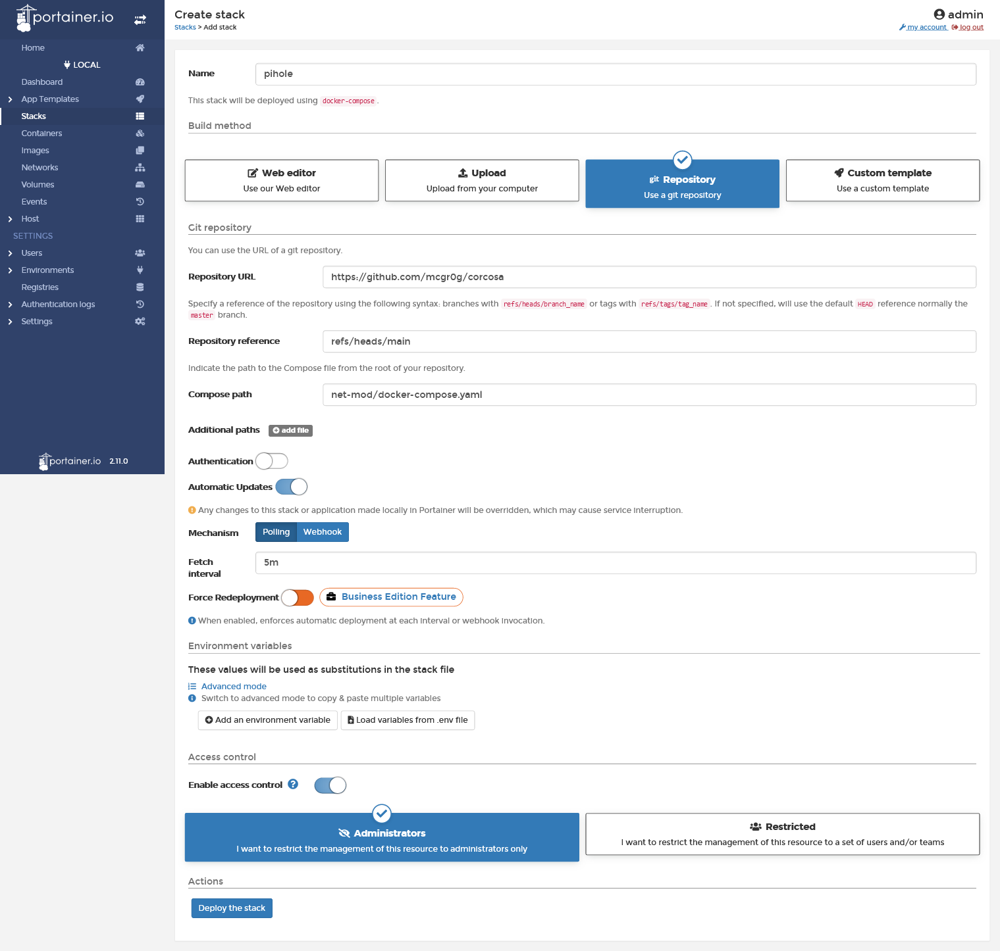
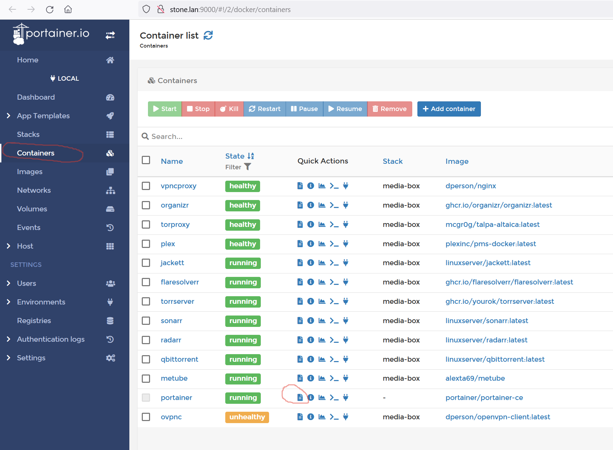

:sectnums:
:toc: left
== docker

Ставится в систему через экстра плагины https://wiki.omv-extras.org/

Мой сетап позволял не переносить служебный каталог на примонтированный диск. Если вам нужно, просто поменяйте путь в Docker Storage.

Portainer - крутой проект и стоит ставить именно его, тем более что он сам устанавливается в образе.

Больше общих рекомендаций нет, можно конфигурить софт.
Его можно разделить на 2 группы:  

- качалки, отдавалки. Общее название media-box
- баннерорезки, разблокировщики. Общее назначение net-mod

Довольно удобно подключать компоузы из веб интерфейса. Для link:../media-box/readme.adoc[media-box] В новом стеке заполняем:

[%autowidth%header,separator=|]
|===
| параметр | назначение | пример 

| Repository URL
| путь до корня репозитария
| https://github.com/mcgr0g/corcosa

| Repository reference
| инструкция использовать в качестве указателя опраделенную ветку [в этом примере]
| refs/heads/main

| Compose path
| путь от корня репозитария на файловой системе до компоуз файла
| media-box/docker-compose.yaml

|===

== where is logs?
Часто при неудачно составленном компоузе, Portainer сыплет ошибками в всплывающее окно. Прощелкал клювом - окно закрылось. 
А даже если и не закрылось, то в окно пишется контекст логов и там будет лишняя информация, которая может сбивать с толку. Нужно смотреть обычные плосские логи.

Где? В WEB UI.

Всего то и нужно ткнуть нужную кнопку

